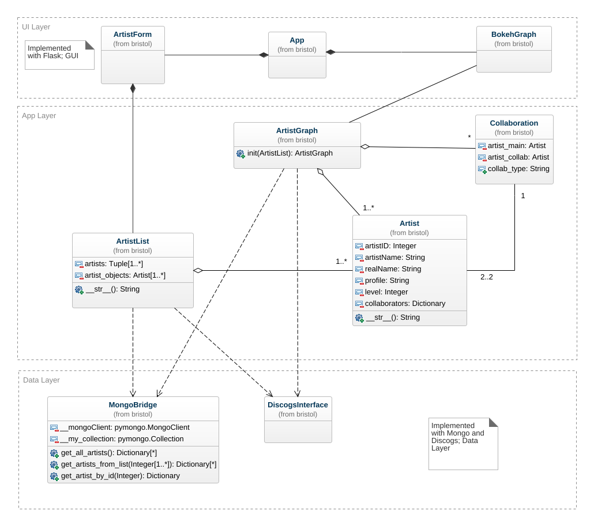

#### Required Libraries
See requirements.txt for the list of all python libraries
used for the implementation and execution of this project.
```bash
$ pip3 install -r requirements.txt
```

#### Execute
```bash
$ python3 -m flask run
```

#### Architecture
* Project is implemented as a 3-tier application
   * ```gui``` directory contains the interface layer
   * ```applayer``` directory contains the logical layer for all interactions
   * ```datalayer``` directory contains the code for interfacing with data sources

